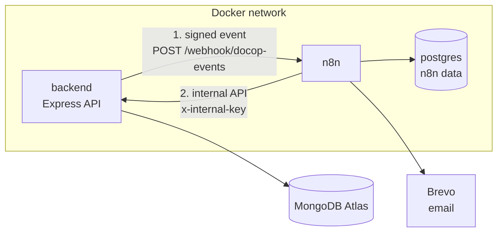

# DocOp Automation (n8n)

DocOp uses [n8n](https://n8n.io) for everything that happens *around* an appointment: confirmation emails, reminders, uptime alerts and a weekly report. The Express backend handles booking and payment; n8n handles notifications.

The backend never waits for n8n. If n8n is down, booking, paying and cancelling still work, and the backend logs that the event was not delivered.

---

## How it fits together



There are two connections, and both are authenticated:

| Direction | What | Protected by |
|---|---|---|
| backend → n8n | Appointment events (`booked`, `paid`, `cancelled`, `completed`) sent to one webhook | HMAC-SHA256 signature + 5-minute timestamp window |
| n8n → backend | Reading data and recording results through `/api/internal/*` | `x-internal-key` header, checked with a timing-safe comparison |

n8n never connects to MongoDB directly. Only the backend reads and writes the database, so all validation stays in one place.

---

## The workflows

All exported workflows are in [`automation workflows/`](./automation%20workflows/).

| Workflow | Trigger | What it does |
|---|---|---|
| **DocOp – Error alerts** | Any other workflow fails | Emails the failed workflow's name, node, error and a link to the run. Every other workflow points to it. |
| **DocOp – Health monitor** | Every 5 minutes | Calls `/api/health`. Emails once when the API is degraded or unreachable, and resets when it recovers, so there is one alert per outage. |
| **DocOp – Appointment events** | Webhook `POST /webhook/docop-events` | Verifies the signature, replies `202` at once, claims the event, then sends patient and doctor emails for the event type. |
| **DocOp – Reminders** | Every day at 18:00 | Finds tomorrow's appointments that haven't had a reminder, marks each one, then emails the patient. |
| **DocOp – Weekly report** | Mondays at 08:00 | Emails booked, paid, completed and cancelled counts for the last 7 days, plus the cancellation rate. |

Schedules run in `Asia/Colombo` time (`GENERIC_TIMEZONE`).

### Appointment events in detail

```
Receive DocOp event → Compute signature → If (valid?)
   ├─ false → Reject 401
   └─ true  → Accept 202 → Claim event → New event?
                                          └─ true → Route by event type
                                                     ├─ booked    → patient + doctor email → Mark completed
                                                     ├─ paid      → patient + doctor email → Mark completed
                                                     ├─ cancelled → patient + doctor email → Mark completed
                                                     └─ completed → patient email          → Mark completed
```

| Event | Sent from | Emails |
|---|---|---|
| `appointment.booked` | `userController.bookAppointment` | Patient confirmation, doctor notification |
| `appointment.paid` | `userController.verifyMockPayment` | Patient receipt, doctor notification |
| `appointment.cancelled` | Patient, doctor or admin cancel (includes `cancelledBy`) | Patient and doctor, saying who cancelled |
| `appointment.completed` | `doctorController.appointmentComplete` | Patient thank-you |

---

## Reliability

**Each event is handled once.** Every event carries a UUID (`id`). Before sending emails, n8n calls `POST /api/internal/events/:id/claim`. The `processed_events` collection has a unique index on `eventId`, so a repeated event (a retry, a network repeat, or a manual re-run) gets `firstTime: false` and is skipped. After the emails, n8n calls `/result` with `status: "completed"`. Records are deleted automatically after 30 days (TTL index).

**Reminders are sent once.** `POST /api/internal/appointments/:id/reminder-sent` sets `reminderSentAt` only if it is still `null`. A second run gets `firstTime: false`.

**Failures are visible.** All workflows use `DocOp – Error alerts`. HTTP and email nodes use Retry On Fail (3 tries, 5 seconds apart). The backend logs `[event] … rejected by n8n: HTTP <code>` or `[event] … not delivered` when an event doesn't arrive.

**Booking never depends on n8n.** `emitEvent()` doesn't wait for a reply and gives up after 3 seconds.

---

## Backend pieces

| File | Purpose |
|---|---|
| `backend/services/eventService.js` | `emitEvent(type, data)`: signs and sends events to n8n |
| `backend/middleware/authInternal.js` | Checks `x-internal-key` on every internal route |
| `backend/routes/internalRoute.js` | Internal API used by n8n |
| `backend/models/processedEventModel.js` | `processed_events`: one record per handled event |
| `backend/models/appointmentModel.js` | `reminderSentAt` field for reminders |

Internal API (all require `x-internal-key`):

| Method and path | Used by | Returns |
|---|---|---|
| `GET /api/internal/appointments/due-reminders?date=D_M_YYYY` | Reminders | Appointments on that date still needing a reminder |
| `POST /api/internal/appointments/:id/reminder-sent` | Reminders | `{ firstTime }` |
| `GET /api/internal/stats/weekly` | Weekly report | `{ booked, cancelled, completed, paid }` |
| `POST /api/internal/events/:eventId/claim` | Appointment events | `{ firstTime }` |
| `POST /api/internal/events/:eventId/result` | Appointment events | Records `completed` or `failed` |

---

## Configuration

Add these to the root `.env` (next to `docker-compose.yml`). Placeholders are in `.env.example`.

| Variable | Used by | What it is |
|---|---|---|
| `N8N_DB_PASSWORD` | postgres, n8n | Password for n8n's Postgres database. Set once and don't change it. |
| `N8N_ENCRYPTION_KEY` | n8n | Encrypts saved credentials. Set once and don't change it. |
| `DOCOP_WEBHOOK_SECRET` | backend, n8n | Shared secret for event signatures |
| `DOCOP_INTERNAL_KEY` | backend, n8n | Key n8n sends to `/api/internal/*` |

Generate secrets with `openssl rand -hex 32`. Use letters and numbers only (`$` and `#` are changed by Docker Compose).

`docker-compose.yml` also sets `N8N_WEBHOOK_BASE=http://n8n:5678/webhook` for the backend and `DOCOP_API_URL=http://backend:8000` for n8n. Inside the Docker network, containers reach each other by service name, not `localhost`.

---

## Setup

1. Fill in the root `.env` and `backend/.env`, then start everything:
   ```bash
   docker compose up -d --build
   ```
2. Open n8n at <http://localhost:5678> and create the owner account.
3. **Credentials:** add a **Brevo** credential with your Brevo API key (it must start with `xkeysib-`). If the Appointment events workflow uses the Crypto node, add a **Crypto** credential whose secret is exactly `DOCOP_WEBHOOK_SECRET`.
4. **Import the workflows**, in this order: Error alerts first, then the others. For each one: **Create workflow → ⋯ → Import from File**.
5. In each workflow, select the credentials on the Brevo (and Crypto) nodes, set **⋯ → Settings → Error workflow → DocOp – Error alerts**, then **Publish**.

Error alerts doesn't need to be published; n8n runs it whenever a linked workflow fails.

---

## Testing

| Do this | Expected |
|---|---|
| `docker compose exec backend wget -qO- --header="Content-Type: application/json" --post-data="{}" http://n8n:5678/webhook/docop-events` | `401` (the workflow is live and rejects unsigned requests) |
| Book an appointment | A green run in **Executions**, two emails, and a `processed_events` record with `status: "completed"` |
| Retry that run in Executions | Stops at **New event?**, no second email |
| Pay, cancel (as patient, doctor or admin), complete | The matching branch runs |
| Book for tomorrow, then run Reminders twice | Exactly one reminder |
| `docker compose stop backend` | "DocOp API is DOWN" within 5 minutes; one email per outage |
| `docker compose stop n8n`, then book | Booking still succeeds; backend logs `not delivered` |

Live runs appear only in the workflow's **Executions** tab, not in the editor's "Listening for test event" view.

---

## Troubleshooting

| Symptom | Likely cause |
|---|---|
| Backend logs `rejected by n8n: HTTP 404` | The Appointment events workflow isn't published, or two workflows use `docop-events` |
| Every event goes to **Reject 401** | The signature secret in n8n doesn't match `DOCOP_WEBHOOK_SECRET`, or the HMAC type isn't SHA256 |
| `Claim event` fails with 404 | The backend container is running old code: `docker compose up -d --build backend` |
| n8n logs `password authentication failed for user "n8n"` | `N8N_DB_PASSWORD` changed after the database was created |
| Brevo credential "Couldn't connect" | The key is deactivated, or Brevo is blocking the IP (**Settings → Security → Authorised IPs**) |
| `$env.…` shows "not accessible via UI" | Normal. n8n hides secrets in the editor and fills them in when the node runs. |

---

## Updating the exported workflows

After changing a workflow in n8n: **⋯ → Download**, save it into `automation workflows/`, check the file contains no `xkeysib`, and commit.
